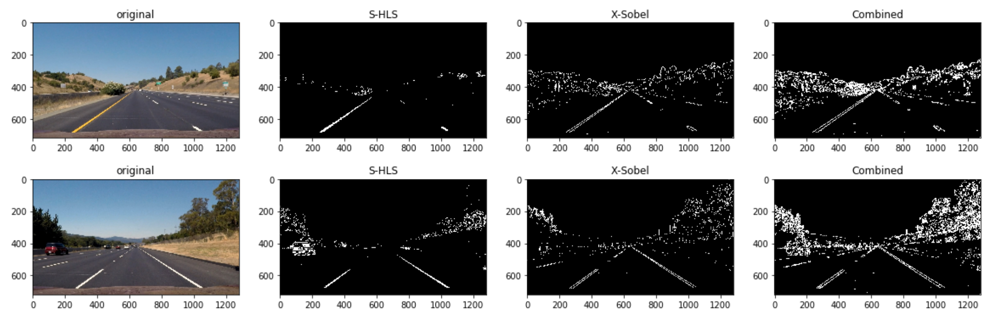
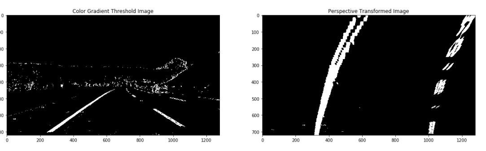

# Advanced Lane Finding Project

The goals / steps of this project are the following:

* Compute the camera calibration matrix and distortion coefficients given a set of chessboard images.
* Apply a distortion correction to raw images.
* Use color transforms, gradients, etc., to create a thresholded binary image.
* Apply a perspective transform to rectify binary image ("birds-eye view").
* Detect lane pixels and fit to find the lane boundary.
* Determine the curvature of the lane and vehicle position with respect to center.
* Warp the detected lane boundaries back onto the original image.
* Output visual display of the lane boundaries and numerical estimation of lane curvature and vehicle position.

## [Rubric](https://review.udacity.com/#!/rubrics/571/view) Points

## Camera Calibration

To calibrate the camera, I used chessboard images from ```camera_cal``` directory. Those chessboard should contains **9** corners in x axis and **6** corners in y axis. However, not all the images in ```camera_cal``` contain those **9 x 6** corners, for example ```calibration1.jpg```. So we need to loop through chessboard images, only collecting image points when ```cv2.findChessboardCorners``` returns ```True```.

```objp``` is the coordinats of corners in real world with format of (x,y,z), with z=0. It can be generated using:
```python
objp = np.zeros((corner_x * corner_y, 3), np.float32)
objp[:,:2] = np.mgrid[0:corner_x, 0:corner_y].T.reshape(-1, 2)
```

For each chessboard image, if we can find **9 x 6** corners, we will append found corners in images space to ```imgpoints``` list and ```objp``` to objpoints list. Then we will use the following function to get camera matrix ```mtx``` and distortion cofficent ```dist```.
```python
ret, mtx, dist, rvecs, tvecs = cv2.calibrateCamera(objpoints, imgpoints, gray_shape[::-1], None, None)

```

## Pipeline

The following sections will describe how each image from video will be processed to detect lines.

In summary, the pipeline has following stages:

| Stage        | 
|:-------------:|
| Distortion Correction|  
| Color/Gradient Threshold| 
| Perspective Transformation| 
| Identify Lines' Pixels and Fit Lines|
| Calculate Radius of Curvature|
| Visualize Lines Region|
| Inverse Perspective Transformation|


### Distortion Correction
The first step is to undistort image using camera matrix ```mtx``` and distortion cofficient ```dist```. Those two parameters are obtained from camera calibration and will be used in ```cv2.undistort``` function.

We can test the undistort function on one chessboard image:

<p align="center">
  
  <br>
  <em>Figure 1: Undistort Chessboard Image</em>
</p>

### Color/Gradient Threshold

After distortion correction, the image will be transformed to a thresholded binary image where lines pixels should be retained. To achieve this, I did two techniques, saturation threshold and x-Sobel threshold.

#### Saturation Threshold

The image will be converted to HLS space and the saturation channel will be used to threshold.

```python
def hls_select(img, thresh=(150, 255)):
    hls = cv2.cvtColor(img, cv2.COLOR_RGB2HLS)
    s_channel = hls[:,:,2]
    
    binary_output = np.zeros_like(s_channel)
    binary_output[(s_channel>thresh[0]) & (s_channel<=thresh[1])] = 1
    return binary_output
```
#### X-Sobel Threshold

Besides, I also choose X-Sobel to reatin all the pixels that have high x-axis graident.

```python
def abs_sobel_thresh(img, gray_scaled = False, orient = 'x', sobel_kernel=5,  thresh = (30, 255)):
    if gray_scaled:
        gray = img
    else:
        gray = cv2.cvtColor(img, cv2.COLOR_RGB2GRAY)
        
    if orient == 'x':
        sobel = cv2.Sobel(gray, cv2.CV_64F, 1, 0, ksize = sobel_kernel)
    else:
        sobel = cv2.Sobel(gray, cv2.CV_64F, 0, 1, ksize = sobel_kernel)
    
    sobel_abs = np.absolute(sobel)
    sobel_scaled = np.uint8(255 * sobel_abs / np.max(sobel_abs))
    
    binary_output = np.zeros_like(sobel_scaled)
    binary_output[ (sobel_scaled > thresh[0]) & (sobel_scaled <= thresh[1])] = 1
    return binary_output
```
#### Combine Color/Gradient Threshold

After getting binary thresholded image from saturation and x-sobel filtering. I used ```or``` operation to retain all the pixels that appear in either image. Here are the result on some test images.

<p align="center">
  
  <br>
  <em>Figure 2: Binary Thresholded Images</em>
</p>


### Perspective Transform

```cv2.getPerspectiveTransform``` function was used to perform perspective transform. To do this, we need provide four points in original image and 4 points in new transformed image, listed as below.

| Source        | Destination   | 
|:-------------:|:-------------:| 
| 245, height-30         | 300, height        | 
| width/2 - 45, 450      | 300, 0     |
| width/2 + 45, 450      | width-300, 0      |
| width-225, height-30   | width-300, height        |

Using those points, we can get transformation matrix and inverse matrix.

```python
M = cv2.getPerspectiveTransform(src_verticles.astype(np.float32), dst_verticles.astype(np.float32))
Minv = cv2.getPerspectiveTransform(dst_verticles.astype(np.float32), src_verticles.astype(np.float32))
```
Having ```M``` and ```Minv``` we can transform image to birdeye view and back.

```python
def perspective_transform(img):
    transformed_img = cv2.warpPerspective(img, M, (width, height), flags=cv2.INTER_LINEAR)
    return transformed_img

def reverse_perspective_transform(img):
    transformed_img = cv2.warpPerspective(img, Minv, (width, height), flags=cv2.INTER_LINEAR)
    return transformed_img
```

The image transformation example is shown in Figure 3.
<p align="center">
  
  <br>
  <em>Figure 3: Perspective Transformation</em>
</p>

### Identify Line Pixels and Fit Lines

After applying saturation/x-Sobel threshold, we can transform the curved lines into birdeye view, as Figure 4 shows.
<p align="center">
  
  <br>
  <em>Figure 4: Binary Wrapped Image and Perspective Transformation</em>
</p>

Next step is to identify left line and right line pixels. I sum up all the pixels in bottom part of the binary transformed image to ```histogram```. Then we can find the bases for left line and right line using:

```python
midpoint = np.int(histogram.shape[0]/2)
leftx_base = np.argmax(histogram[:midpoint])
rightx_base = np.argmax(histogram[midpoint:]) + midpoint
```

Starting with the bases, we will use two sliding windows(with width 200) to sweep the image from bottom to top. As the windowns moving up, the pixels inside them are collected as lines' pixels and the x value will be changed to the mean value of those pixels if we have more than 50 pixels in one window. Then we fit those pixels by second order polynomial.

```python
# Fit a second order polynomial to each
left_fit = np.polyfit(lefty, leftx, 2)
right_fit = np.polyfit(righty, rightx, 2)
```

The fitting result is shown in Figure 5. All the pixels identified as left line are labeled red while right line are labeled bule. The fitting lines are drawn in yellow. The green regions show the lines we detected. 

<p align="center">
  
  <br>
  <em>Figure 5: Line Fitting</em>
</p>

### Calculate Radius of Curvature

Before calculating radius of curvature, we first need to convert pixel length to real world meter. We define two different conversion cofficients here:

```python
# Define conversions in x and y from pixels space to meters
ym_per_pix = 30/720 # meters per pixel in y dimension
xm_per_pix = 3.7/700 # meters per pixel in x dimension
```
Then all the pixels are converted to meter unit and we perfrom second order polynomial fitting on those converted pixels.
```python

ploty = np.linspace(0, 719, num=720)
leftx = left_fit[0]*ploty**2 + left_fit[1]*ploty + left_fit[2]
rightx = right_fit[0]*ploty**2 + right_fit[1]*ploty + right_fit[2]

# Fit new polynomials to x,y in world space
left_fit_cr = np.polyfit(ploty*ym_per_pix, leftx*xm_per_pix, 2)
right_fit_cr = np.polyfit(ploty*ym_per_pix, rightx*xm_per_pix, 2)
```

Then we use the following formula to calculate the radius of curvature on ```y_eval = 360```.

```python

# Calculate the new radii of curvature
left_curverad = ((1 + (2*left_fit_cr[0]*y_eval*ym_per_pix + left_fit_cr[1])**2)**1.5) / np.absolute(2*left_fit_cr[0])
right_curverad = ((1 + (2*right_fit_cr[0]*y_eval*ym_per_pix + right_fit_cr[1])**2)**1.5) / np.absolute(2*right_fit_cr[0])
```

In the above example image, we can get:

```
left radius: 506.305718298 m
right radius: 529.417781407 m
```

In terms of the position of the vehicle with respect to center, we just use the center pixel's x value of the two lines when ```y=720``` and substract it from the x value of center pixel of the image.

### Result Visualization

Finally, we will draw a green region on the lane that has been detected. We first use '''cv2.fillPoly''' function to draw the region in birdeye view. Then it is converted back to original view and overlap with original image using ```cv2.addWeighted```. We can see some example images in figure 6.

<p align="center">
  
  <br>
  <em>Figure 6: Final Result</em>
</p>

### Final Video
We combine all the sub function above into ```detect_lines``` function and apply it for each frame in the project video.
The generated [Video](https://github.com/XQ-UT/CarND-Advanced-Lane-Lines/tree/master/output_video) is uploaded to this repo.

### Discussion and Improvement

#### Lines Tracking

#### X-Sobel Again

