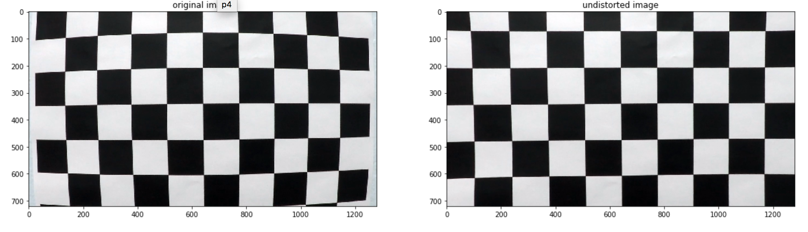
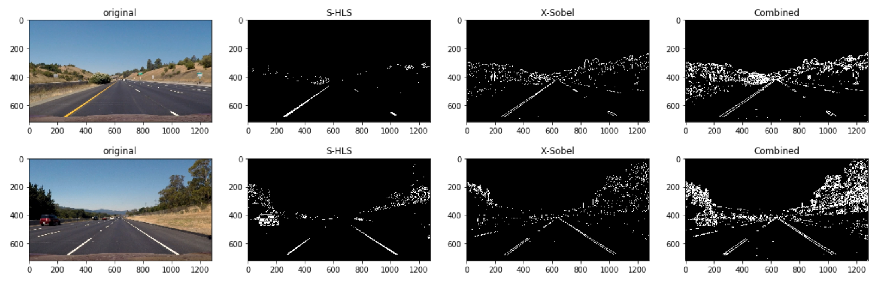
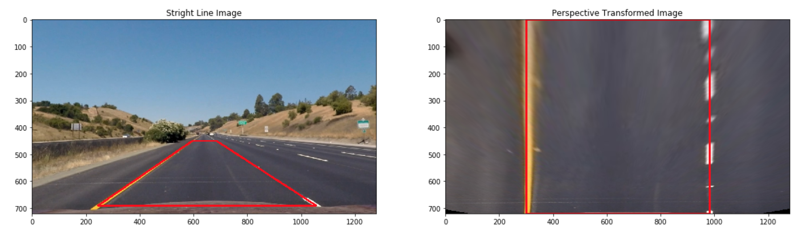

# Advanced Lane Finding Project

The goals / steps of this project are the following:

* Compute the camera calibration matrix and distortion coefficients given a set of chessboard images.
* Apply a distortion correction to raw images.
* Use color transforms, gradients, etc., to create a thresholded binary image.
* Apply a perspective transform to rectify binary image ("birds-eye view").
* Detect lane pixels and fit to find the lane boundary.
* Determine the curvature of the lane and vehicle position with respect to center.
* Warp the detected lane boundaries back onto the original image.
* Output visual display of the lane boundaries and numerical estimation of lane curvature and vehicle position.

## [Rubric](https://review.udacity.com/#!/rubrics/571/view) Points

## Camera Calibration

To calibrate the camera, I used chessboard images from ```camera_cal``` directory. Those chessboard should contains **9** corners in x axis and **6** corners in y axis. However, not all the images in ```camera_cal``` contain those **9 x 6** corners, for example ```calibration1.jpg```. So we need to loop through chessboard images, only collecting image points when ```cv2.findChessboardCorners``` returns ```True```.

```objp``` is the coordinats of corners in real world with format of (x,y,z), with z=0. It can be generated using:
```python
objp = np.zeros((corner_x * corner_y, 3), np.float32)
objp[:,:2] = np.mgrid[0:corner_x, 0:corner_y].T.reshape(-1, 2)
```

For each chessboard image, if we can find **9 x 6** corners, we will append found corners in images space to ```imgpoints``` list and ```objp``` to objpoints list. Then we will use the following function to get camera matrix ```mtx``` and distortion cofficent ```dist```.
```python
ret, mtx, dist, rvecs, tvecs = cv2.calibrateCamera(objpoints, imgpoints, gray_shape[::-1], None, None)

```

## Pipeline

The following sections will describe how each image from video will be processed to detect lines.
### Distortion Correction
The first step is to undistort image using camera matrix ```mtx``` and distortion cofficient ```dist```. Those two parameters are obtained from camera calibration and will be used in ```cv2.undistort``` function.

We can test the undistort function on one chessboard image:

<p align="center">
  
  <br>
  <em>Figure 1: Undistort Chessboard Image</em>
</p>

### Color/Gradient Threshold

After distortion correction, the image will be transformed to a thresholded binary image where lines pixels should be retained. To achieve this, I did two techniques, saturation threshold and x-Sobel threshold.

#### Saturation Threshold

The image will be converted to HLS space and the saturation channel will be used to threshold.

```python
def hls_select(img, thresh=(150, 255)):
    hls = cv2.cvtColor(img, cv2.COLOR_RGB2HLS)
    s_channel = hls[:,:,2]
    
    binary_output = np.zeros_like(s_channel)
    binary_output[(s_channel>thresh[0]) & (s_channel<=thresh[1])] = 1
    return binary_output
```
#### X-Sobel Threshold

Besides, I also choose X-Sobel to reatin all the pixels that have high x-axis graident.

```python
def abs_sobel_thresh(img, gray_scaled = False, orient = 'x', sobel_kernel=5,  thresh = (30, 255)):
    if gray_scaled:
        gray = img
    else:
        gray = cv2.cvtColor(img, cv2.COLOR_RGB2GRAY)
        
    if orient == 'x':
        sobel = cv2.Sobel(gray, cv2.CV_64F, 1, 0, ksize = sobel_kernel)
    else:
        sobel = cv2.Sobel(gray, cv2.CV_64F, 0, 1, ksize = sobel_kernel)
    
    sobel_abs = np.absolute(sobel)
    sobel_scaled = np.uint8(255 * sobel_abs / np.max(sobel_abs))
    
    binary_output = np.zeros_like(sobel_scaled)
    binary_output[ (sobel_scaled > thresh[0]) & (sobel_scaled <= thresh[1])] = 1
    return binary_output
```
#### Combine Color/Gradient Threshold

After getting binary thresholded image from saturation and x-sobel filtering. I used ```or``` operation to retain all the pixels that appear in either image. Here are the result on some test images.

<p align="center">
  
  <br>
  <em>Figure 2: Binary Thresholded Images</em>
</p>


### Perspective Transform

```cv2.getPerspectiveTransform``` function was used to perform perspective transform. To do this, we need provide four points in original image and 4 points in new transformed image, listed as below.

| Source        | Destination   | 
|:-------------:|:-------------:| 
| 245, height-30         | 300, height        | 
| width/2 - 45, 450      | 300, 0     |
| width/2 + 45, 450      | width-300, 0      |
| width-225, height-30   | width-300, height        |

Using those points, we can get transformation matrix and inverse matrix.

```python
M = cv2.getPerspectiveTransform(src_verticles.astype(np.float32), dst_verticles.astype(np.float32))
Minv = cv2.getPerspectiveTransform(dst_verticles.astype(np.float32), src_verticles.astype(np.float32))
```
Having ```M``` and ```Minv``` we can transform image to birdeye view and back.

```python
def perspective_transform(img):
    transformed_img = cv2.warpPerspective(img, M, (width, height), flags=cv2.INTER_LINEAR)
    return transformed_img

def reverse_perspective_transform(img):
    transformed_img = cv2.warpPerspective(img, Minv, (width, height), flags=cv2.INTER_LINEAR)
    return transformed_img
```

The image transformation example is shown in Figure 3.
<p align="center">
  
  <br>
  <em>Figure 3: Perspective Transformation</em>
</p>

### Identify Line Pixels 

### Fit Lines

### Calculate Radius of Curvature

### Result Visualization

### Final Video

### Improvement

#### 1. Provide an example of a distortion-corrected image.

To demonstrate this step, I will describe how I apply the distortion correction to one of the test images like this one:
![alt text][image2]

#### 2. Describe how (and identify where in your code) you used color transforms, gradients or other methods to create a thresholded binary image.  Provide an example of a binary image result.

I used a combination of color and gradient thresholds to generate a binary image (thresholding steps at lines # through # in `another_file.py`).  Here's an example of my output for this step.  (note: this is not actually from one of the test images)

![alt text][image3]

#### 3. Describe how (and identify where in your code) you performed a perspective transform and provide an example of a transformed image.

The code for my perspective transform includes a function called `warper()`, which appears in lines 1 through 8 in the file `example.py` (output_images/examples/example.py) (or, for example, in the 3rd code cell of the IPython notebook).  The `warper()` function takes as inputs an image (`img`), as well as source (`src`) and destination (`dst`) points.  I chose the hardcode the source and destination points in the following manner:

```python
src = np.float32(
    [[(img_size[0] / 2) - 55, img_size[1] / 2 + 100],
    [((img_size[0] / 6) - 10), img_size[1]],
    [(img_size[0] * 5 / 6) + 60, img_size[1]],
    [(img_size[0] / 2 + 55), img_size[1] / 2 + 100]])
dst = np.float32(
    [[(img_size[0] / 4), 0],
    [(img_size[0] / 4), img_size[1]],
    [(img_size[0] * 3 / 4), img_size[1]],
    [(img_size[0] * 3 / 4), 0]])
```

This resulted in the following source and destination points:

| Source        | Destination   | 
|:-------------:|:-------------:| 
| 585, 460      | 320, 0        | 
| 203, 720      | 320, 720      |
| 1127, 720     | 960, 720      |
| 695, 460      | 960, 0        |

I verified that my perspective transform was working as expected by drawing the `src` and `dst` points onto a test image and its warped counterpart to verify that the lines appear parallel in the warped image.

![alt text][image4]

#### 4. Describe how (and identify where in your code) you identified lane-line pixels and fit their positions with a polynomial?

Then I did some other stuff and fit my lane lines with a 2nd order polynomial kinda like this:

![alt text][image5]

#### 5. Describe how (and identify where in your code) you calculated the radius of curvature of the lane and the position of the vehicle with respect to center.

I did this in lines # through # in my code in `my_other_file.py`

#### 6. Provide an example image of your result plotted back down onto the road such that the lane area is identified clearly.

I implemented this step in lines # through # in my code in `yet_another_file.py` in the function `map_lane()`.  Here is an example of my result on a test image:

![alt text][image6]

---

### Pipeline (video)

#### 1. Provide a link to your final video output.  Your pipeline should perform reasonably well on the entire project video (wobbly lines are ok but no catastrophic failures that would cause the car to drive off the road!).

Here's a [link to my video result](./project_video.mp4)

---

### Discussion

#### 1. Briefly discuss any problems / issues you faced in your implementation of this project.  Where will your pipeline likely fail?  What could you do to make it more robust?

Here I'll talk about the approach I took, what techniques I used, what worked and why, where the pipeline might fail and how I might improve it if I were going to pursue this project further.  
